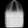
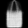

# Conditional Variational Encoded development and Deployment

## Table of Contents
- [Conditional Variational Encoded development and Deployment](#conditional-variational-encoded-development-and-deployment)
  - [Table of Contents](#table-of-contents)
  - [Introduction](#introduction)
  - [Getting Started](#getting-started)
  - [Model Results](#model-results)
  - [Additional Information](#additional-information)

```bash
|   ReadMe.md
|
+---assets
|       0_0.jpeg
|       1_1.jpeg
|       1_2.jpeg
|       2_2.jpeg
|
+---docs
|       index.html
|       main.html
|       search.json
|       ui.html
|
+---Fastapi
|      decoder.h5
|      Dockerfile
|      main.py
|      requirements.txt
|   

|
+---models
|       decoder.h5
|
+---notebooks
|       requirements.txt
|       vae.ipynb
|
\---User_interface
       decoder.h5
       Dockerfile
       requirements.txt
       ui.py
    
  
```
## Introduction
Experimentation of VAE models and simple docker deployment of a streamlit app as well as a post api
## Getting Started
To deploy FASPTPI use the dockerfile in the fastapi to generate the image and deploy the image if needed. The same can be done for the user_interface folder. Docs has the automatically generated docstrings for the project.

To run Fastapi 
```
docker build -t fastapi_vae ./Fastapi
docker run -d --name fastapi_vae_container -p 80:80 fastapi_vae

```
To run streamlit ui
```
docker build -t User_interface_vae ./User_interface
docker run -d --name Ui_vae_container -p 80:80 User_interface_vae

```
Models are replicated as dockerfile is unable to go up one directory
## Model Results
Here is a generated image from the CVAE by tweaking the latent variables while using the label of bag 





## Additional Information
basecode for CVAE models gotten from:

(https://github.com/nnormandin/Conditional_VAE)